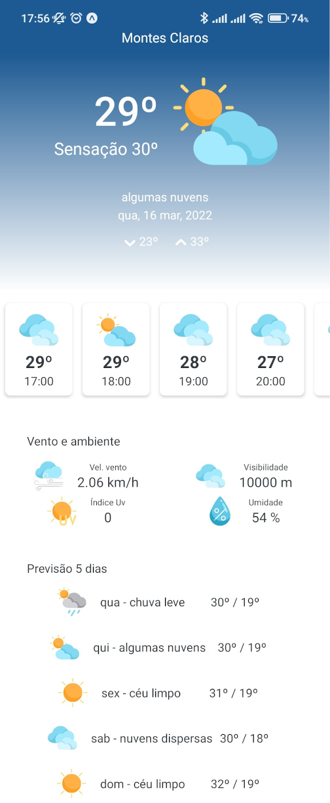
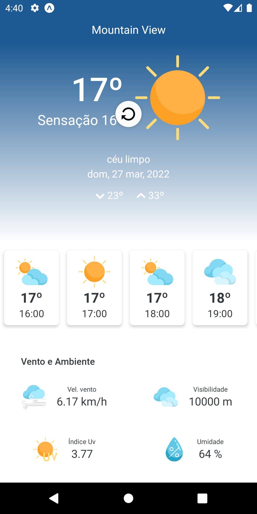

# b_weather

- Pequena aplicação para obter a previsão do tempo com base na geolocalização do aparelho do usuário.

## Pré requisito
- Acessar a página https://home.openweathermap.org/users/sign_up criar uma conta gratuita (no caso de ainda não possuir), completar o processo de validação e obter a chave/token para uso da API.
- Renomear o arquivo .env.example que está na raiz no projeto para .env e adicionar o valor da chave/token do openweathermap a chave API_KEY desse arquivo ficando:

```
  API_KEY=00000000000000000(numero da chave/token)
```

## Como executar e testar o aplicativo

- Na pasta raiz do projeto abri um terminal (console / prompt) e executar o comando npm install ou yarn install e aguardar a finalização da instalação
- Após a instalação das bibliotecas do projeto, executar o comando expo start no mesmo terminal aberto na raiz do projeto.
- O Expo fará o build do projeto e ao final irá disponibilizar diversas forma de executar o aplicativo.
- Pode ser executado lendo o QR code que aparece no próprio terminal.
- Para execução em um emulador, basta no mesmo terminal apertar a tecla A para rodar em android.

- Após abrir o aplicativo deve surgir na tela uma solicitação de permissão para uso da localização do device, basta aceitar enquanto estiver usando o aplicativo.

## Tela Inicial do App

- O aplicativo irá carregar as informações com base na geolocalização e exibir em tela detalhes do clima atualizados como imagem abaixo.



- É possível atualizar os dados a qualquer momento, para isso basta puxar para baixo a tela do aplicativo quando ela estiver no topo, será exibido um ícone indicando o processo de reload e após obter novos dados a tela do app será exibida com dados atualizados.



